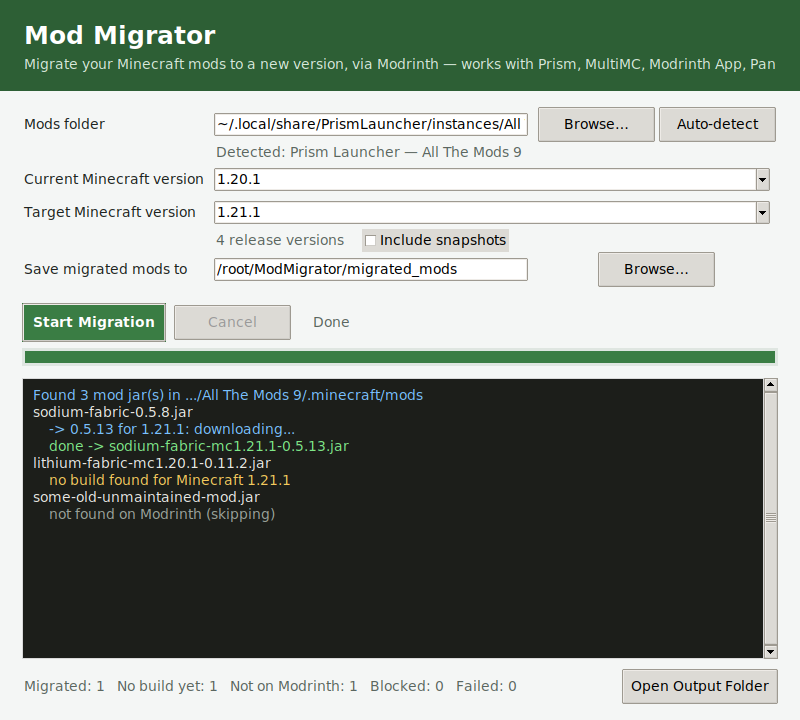

# Mod Migrator

A small desktop app that migrates your Minecraft mods to a new Minecraft
version using [Modrinth](https://modrinth.com).

It hashes each installed `.jar`, looks it up on Modrinth, finds a build that
matches your target Minecraft version (and the same mod loader you're
already using), and downloads it for you — all from a simple GUI.

Works with **Prism Launcher, MultiMC, the Modrinth App, Pandora,
ATLauncher, GDLauncher, CurseForge, Technic**, and a plain `.minecraft` —
or literally any launcher via the **Browse** button.



## Download

Grab the latest build for your OS from the
[Releases page](../../releases/latest):

| OS | File |
|---|---|
| Windows | `ModMigrator-Windows.exe` |
| macOS (Intel & Apple Silicon) | `ModMigrator-macOS-Universal.zip` |
| Linux | `ModMigrator-Linux` |

The macOS download is a single universal2 binary that runs natively on both
Intel and Apple Silicon Macs.

No installation, no Python required — just download and run.

> **First-run warnings are expected.** These builds aren't signed with a
> paid code-signing certificate, so:
> - **Windows** will show a SmartScreen "unrecognized app" warning. Click
>   **More info → Run anyway**.
> - **macOS** will refuse to open it the first time ("cannot be opened
>   because the developer cannot be verified"). **Right-click (or
>   Control-click) the app → Open → Open**, just once.
> - **Linux**: mark it executable first if needed: `chmod +x ModMigrator-Linux`.

## How it works

1. **Pick your mods folder.** Click **Auto-detect** to scan your installed
   launchers (it knows the default locations for all the launchers listed
   above), or **Browse** to point at any instance's `mods` folder manually.
   When auto-detect finds more than one instance, you choose from the list.
2. **Choose Minecraft versions from the dropdowns.** The current and target
   version menus are filled in live from Modrinth's version list. Tick
   **Include snapshots** to show non-release versions too. If the list
   can't be fetched (offline, etc.), the fields stay typeable so you can
   enter versions by hand.
3. **Click Start Migration.** Each mod is identified by hashing its `.jar`
   and matching it against Modrinth's database — this works no matter where
   you originally downloaded the jar from, as long as Modrinth hosts that
   exact file.
4. Matching builds for your target version are downloaded into a separate
   output folder. **Your existing mods folder is never modified or
   deleted.** Review the report, then copy the new jars over yourself.

Anything that can't be resolved (not on Modrinth, no build for your target
version yet, etc.) shows up in the log and the `migration_report.txt`
written to your output folder, instead of being silently skipped.

## Security model

Before any downloaded file is kept, two checks have to pass:

- **Source check** — the download URL must point at Modrinth's real CDN
  (`cdn.modrinth.com`) over HTTPS. Anything else (including convincing
  lookalike domains) is refused.
- **Integrity check** — the downloaded bytes are re-hashed (SHA-512 or
  SHA-1) and compared against the hash Modrinth's API reported for that
  file. A mismatch means the file is deleted immediately, never installed,
  and flagged in the report.

This protects the download step itself. It can't protect against
Modrinth's own catalog being wrong, or an account on Modrinth uploading
something malicious to its own project page — no client-side tool can fully
solve that; the same trust assumption exists if you download a mod by hand
from modrinth.com in a browser.

## Building it yourself

The app is a single dependency-free Python script
(`mod_migrator_gui.py`, stdlib + Tkinter only). To build a standalone
executable locally:

| OS | Run |
|---|---|
| Windows | double-click `build_windows.bat` |
| macOS | double-click `build_macos.command` |
| Linux | `bash build_linux.sh` |

Each script installs [PyInstaller](https://pyinstaller.org/) if needed and
builds the executable into a `dist/` folder next to the script.

Or build it on every platform at once without owning any of those
machines: pushing a tag like `v1.0.0` to this repo triggers
[`.github/workflows/build.yml`](.github/workflows/build.yml), which builds
Windows, Linux, and a universal2 macOS executable (one binary that runs on
both Intel and Apple Silicon) on GitHub's free cloud runners and attaches
them to a new GitHub Release automatically.

### Turning the Windows builder into an .exe (IExpress)

If you specifically want the Windows builder `.bat` itself wrapped as a
double-clickable `.exe`, the [`iexpress/`](iexpress/) folder does that using
IExpress, a tool built into Windows. See
[`iexpress/README.md`](iexpress/README.md) for the steps and some important
caveats (notably that IExpress self-extractors commonly trip antivirus false
positives — the PyInstaller routes above produce a cleaner `ModMigrator.exe`
and remain the recommended path).

## Running from source

```
python3 mod_migrator_gui.py
```

Needs Python 3.8+ with Tk support. This ships with the official
python.org installers for Windows and macOS. On Linux you may need to
install it separately, e.g. `sudo apt install python3-tk`.

There's also a plain command-line version, `migrate_mods.py`, with the same
underlying logic, for anyone who prefers a terminal.

## Limitations

- Only mods Modrinth actually hosts can be auto-identified. CurseForge-only
  mods, or ones you compiled/edited yourself, won't match and will be
  listed in the report for you to handle manually.
- Modrinth doesn't always have a build for every Minecraft version —
  those are reported, not guessed at.
- Auto-detect covers each launcher's *default* data location. If you've
  moved your instances elsewhere, or use a launcher not in the list, the
  **Browse** button works universally — point it at any `mods` folder.
- The Linux build targets an older Ubuntu base for broad compatibility,
  but very old distributions (or unusual glibc setups) may still not run
  it; running from source is the fallback in that case.

## License

MIT — see [LICENSE](LICENSE).
